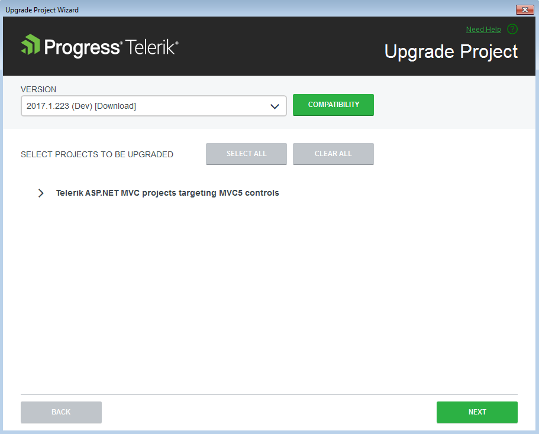
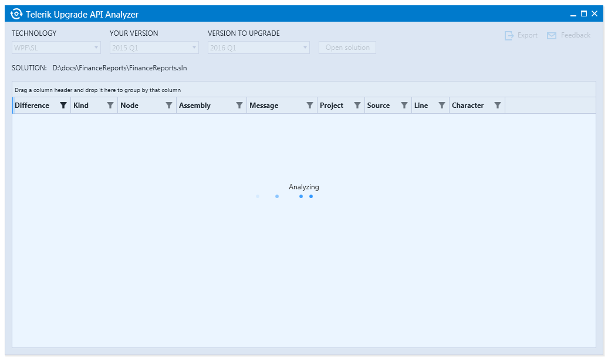

# Upgrading Project API

Each new Kendo UI release might include changes that affect the public Kendo UI API.  

In such cases, you need to avoid possible issues by upgrading your application to the latest Telerik release. To achieve this, use the Telerik Upgrade API Analyzer. The Upgrade API Analyzer aims at making the upgrade process easier by both comparing the versions and determining the problematic areas. You can also use the Upgrade API Analyzer for upgrading desktop applications such as WPF, WinForms, and Silverlight.

Currently, the Upgrade API Analyzer supports Telerik releases starting from Q2 2013 SP1 (2013.2.918) to Q1 2017 (2017.1.118). Upon request, additional releases can also be added.

## Overview

While it upgrades the Telerik controls to a recent version, the Upgrade API Analyzer analyzes the code of your project. As a result, it provides a list of the differences between the currently used release and the release you are planning to upgrade your application to such as obsolete, removed, or modified methods and properties.

The tool also points out the exact piece of code that is affected by a certain change. In the cases of an obsolete method or property, the tool provides suggestions for you to modify that code.                      

> **Important**
>
> Currently, Telerik Upgrade API Analyzer checks only the C# code of the applications.

## Getting Started

Telerik Upgrade API Analyzer is a click-once application. To download the installation, refer to its [setup page](http://demos.telerik.com/UpgradeAPIAnalyzer/setup.exe).

> **Important**
>
> The tool relies on Microsoft .NET Framework 4.5.2. If not installed on your machine, the setup of the tool installs it automatically.

### Running the Tool

1. Run the Upgrade API Analyzer. As a result, the tool opens the following screen:

		**Figure 1: The initial screen of Telerik Upgrade API Analyzer**

		

1. On the screen, select the platform.

1. Select the current version of the Telerik assemblies you are using.

1. Select the version to upgrade to. Because the three combo-boxes are populated on the fly upon your selection, choose the values consecutively.

1. Open the solution you are planning to upgrade.  

Alternatively, you can also run the Upgrade API Analyzer from the [Upgrade Project Wizard]() by clicking the **Compatibility** button as demonstrated on **Figure 2**. As a result, the wizard provides the **Technology**, **Your Version**, and **Version to Upgrade** parameters. When you start the Upgrade API Analyzer directly through the **Compatibility** button without installing the tool first, the installation starts automatically. If the .NET Framework 4.5.2 is not present on your machine, the application prompts you to install it manually at the end of the installation.

**Figure 2: The Compatibility button in the Upgrade API Analyzer**

### Analyzing the Changes

After the setup of the tool is ready, the Upgrade API Analyzer starts analyzing the code.

**Figure 3: The tool starts analyzing as soon as you open a solution**

The tool lists all the changes that are found between the two versions. To present the results from the comparison, the it uses the [RadGridView for WPF](http://docs.telerik.com/devtools/wpf/controls/radgridview/overview2.html), which provides options for data handling such as sorting, filtering, and resizing columns.

**Figure 4: The Upgrade API Analyzer lists the found differences**

For each change, the grid presents the following information:

* **Difference**&mdash;Teh possible values are **Obsolete**, **Deleted**, or **Modified**. By default, the modified changes are not displayed because they indicate an internal update in the method or class which generally does not affect its function and does not require you to act. However, the modified changes become available when you update the filter of the **Difference** column.

		**Figure 5: Displaying all found changes including the modifications**

		

* **Kind**&mdash;The possible values are **Type**, **Property**, **Method**, and **Field**.
* **Node**&mdash;The name of the **Type**, **Property**, **Method**, or **Field** value.
* **Assembly**&mdash;The assembly in which the change is found.
* **Message**&mdash;Renders a message that instructs you what to do next. The message provides additional information on the necessary action regarding the particular change to make the upgrade flawless.
* **Project**&mdash;The project where the change resides.
* **Source**&mdash;The file in the project where the change is found.
* **Line**&mdash;The exact line in the source file.
* **Character**&mdash;The character in the previously set line.

Additionally, the Upgrade API Analyzer allows you to save the gathered information through the **Export** button that is located in the upper right corner. The data is arranged and exported to an HTML document. The exported information includes the currently visible (filtered) data in the grid.

**Figure 6: The Upgrade API Analyzer allows an HTML export functionality**

## Feedback and Updates

To provide your feedback on the Upgrade API Analyzer, either send your comments:

* Through the **Feedback** link inside the Upgrade API Analyzer, or
* Directly to [UpgradeApiAnalyzer@telerik.com](mailto:UpgradeApiAnalyzer@telerik.com).

For more information on possible issues and their solutions, refer to the section on the frequently asked questions in the [API Analyzer Helps Upgrading Telerik Projects](http://www.telerik.com/blogs/api-analyzer-helps-upgrading-telerik-projects) blog post.

## See Also

* [Setup Page for Telerik Upgrade API Analyzer](http://demos.telerik.com/UpgradeAPIAnalyzer)
* [Upgrade Project Wizard]()
* [RadGridView for WPF](http://docs.telerik.com/devtools/wpf/controls/radgridview/overview2.html)
